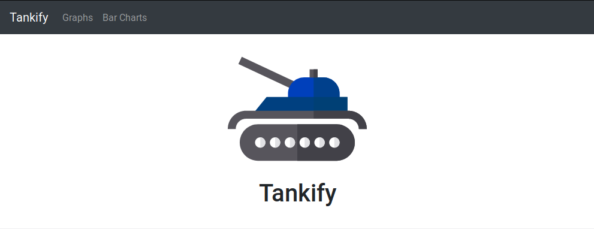
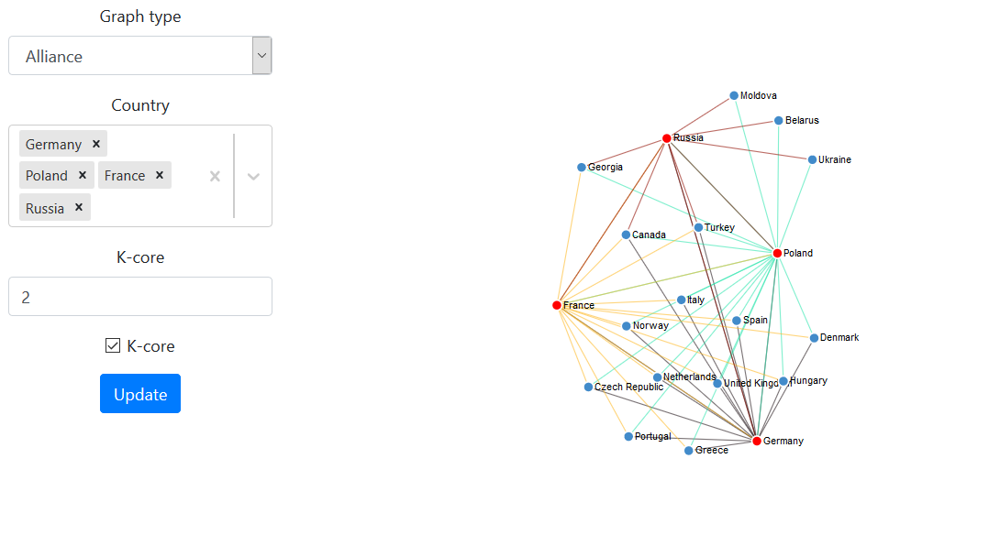
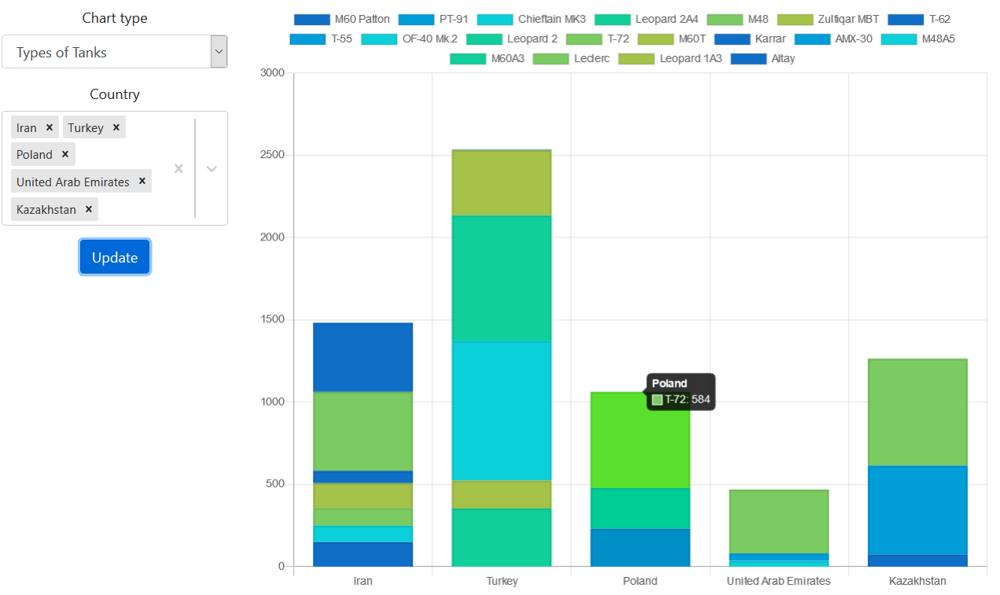

# TASS
https://tankify.netlify.com

## Graphs

## Bar charts

## Setup
In order to run this application you have to run backend and frontend applications. Instructions how to install and run them are inside respective folders `backend` and `frontend`.